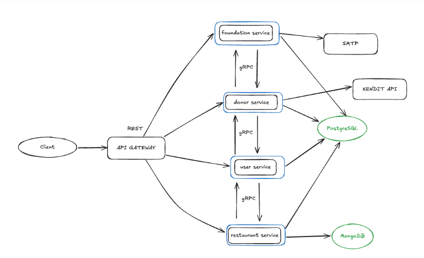
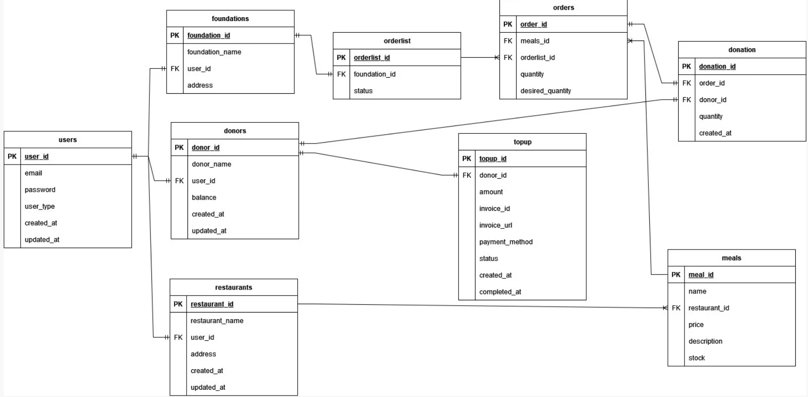

# Sarapan Bersama

## Description: 

Donation application so people can participate with government program "Makan Bergizi Gratis"

## Background:

> The government’s new program, “Makan Bergizi Gratis” has garnered a wide range of reactions from the public, including praise, criticism, and diverse opinions. One common criticism revolves around the menu options offered in the program. This feedback sparked an idea: what if we, as members of the community, could actively participate in shaping the menu and contributing to the success of the “Makan Bergizi Gratis” program.

## Highlights:

* Microservices Architecture
* Serverless Deployment with Google Cloud Run
* Payment Gateway (Xendit)
* Email notifications

### Tech stacks:

* Go
* Echo
* gRPC
* Docker
* PostgreSQL
* MongoDB
* JWT-Authorization
* 3rd Party APIs (Xendit, SMTP)
* REST
* Swagger

## Application Flow



## ERD



## Deployment

This app is containerized and deployed to Google Cloud Platform as a microservices. This means for each service (user-service, foundation-service, donor-service, restaurant-service and api-gateway) is a separate instance. 

### **Base URL for API Gateway:**
```bash
https://api-gateway-75625270837.asia-southeast2.run.app/
```

## Quick Start Endpoint Testing
### 1. **Register User**
- **Endpoint:**
  ```bash
  POST https://api-gateway-75625270837.asia-southeast2.run.app/user/register
  ```
  
- **Payloads** (Based on User Type):
  - **For Donor:**
    ```json
    {
        "email": "YOUR_EMAIL",
        "password": "YOUR_PASSWORD",
        "user_type": "donor",
        "name": "YOUR_DONOR_NAME"
    }
    ```
  - **For Restaurant or Foundation:**
    ```json
    {
        "email": "YOUR_EMAIL",
        "password": "YOUR_PASSWORD",
        "user_type": "restaurant" or "foundation",
        "name": "YOUR_RESTAURANT_NAME_OR_FOUNDATION_NAME",
        "address": "YOUR_ADDRESS"
    }
    ```

---

### 2. **Login User**
- **Endpoint:**
  ```bash
  POST https://api-gateway-75625270837.asia-southeast2.run.app/user/login
  ```

- **Payload:**
    ```json
    {
        "email": "YOUR_EMAIL",
        "password": "YOUR_PASSWORD"
    }
    ```

- **Response (Success):**
  - Returns an **access token** that must be included in the `Authorization` header (as `Bearer TOKEN`) for subsequent requests.
